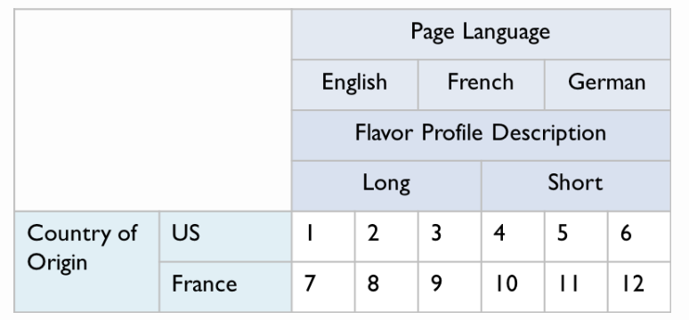
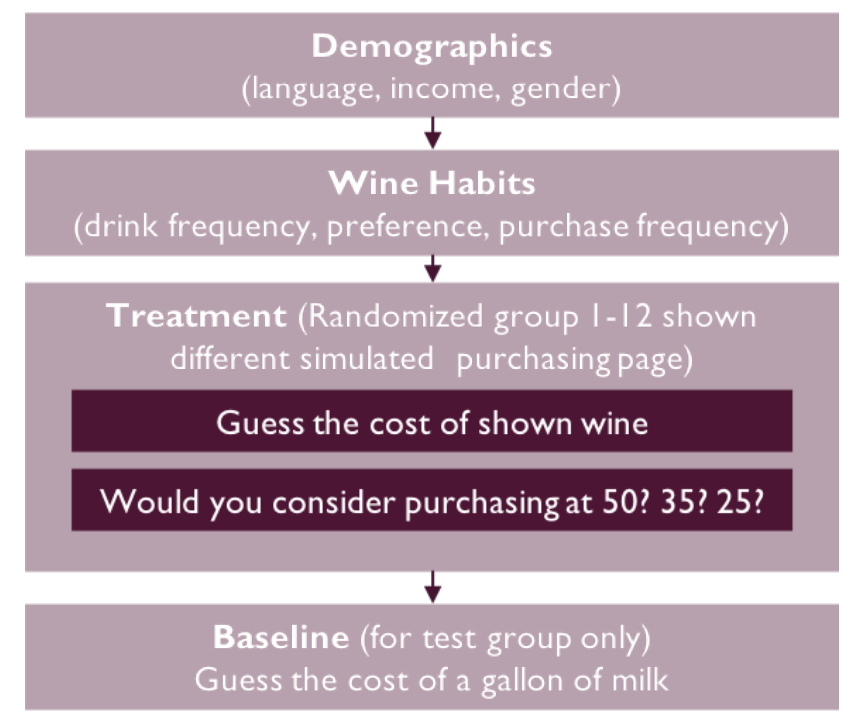
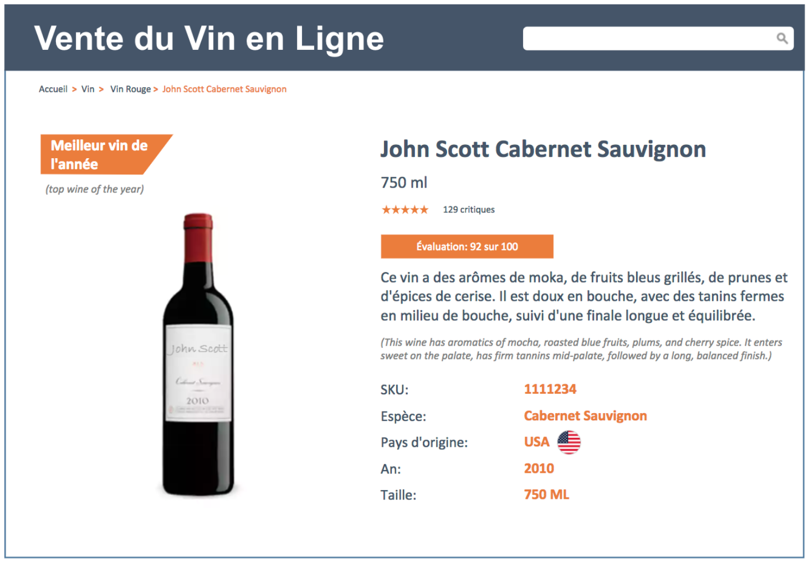
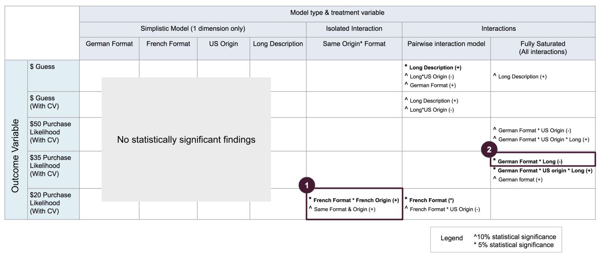

# Foreign-Language-Advertising-Experiment

--Data Science project at UC Berkeley--  
--Team: [Sharad Varadarajan](https://www.linkedin.com/in/sharadv/), [Charlotte Swavola](https://www.linkedin.com/in/charlotte-swavola/), [Rory Liu](https://www.linkedin.com/in/rory-liu-ba6a8718/)--  

Summary
-------

In this study, our team sought to understand the relationship between foreign language advertising in wine retail and consumer willingness to pay/price perception. The high variance of wine prices, along with the strong association between place of origin and the signal on quality made it a great subject for our field experiment. We designed, launched, and analyzed the results of a multifactorial design that toggled three treatment variables of interest: advertising language, wine’s country of origin, and length of flavor profile description.

- Advertising Language: English, French
- Wine's Country of Origin: USA, France, Germany
- Length of Flavor Profile Description: Long, Short

This equates to a 3 x 2 x 2 factorial design (ie. 12 unique treatment conditions).

We conducted the experiment through a Qualtrics survey, and gathered responses via Mechanical Turk. For the survey, participants first answer demographic questions, then were prompted with the treatment. The multiple treatments were administered simultaneously in the form of an image of an online marketing page. The participants were then asked to guess the value of the wine advertised to them; this provided a continuous outcome variable. They were then asked if they would purchase the wine at three descending price points ($50, $35, $20), which would be used as binary variables to calculate purchase likelihood.

Below you can see one of the 12 unique online marketing pages we designed. The treatment for this page is:

- Advertising Language: French
- Wine's Country of Origin: USA
- Length of Flavor Profile Description: Long

After thorough data cleansing and EDA, the team performed a number of different of analytical methods to validate our experimental assumptions:

- Covariate balance checks
- Attrition checks
- Heterogeneous Treatment effect checks

Subsequently, we modeled our data to see if our treatment had an effect on price perception of the advertised wine. This included:

- Randomization Inference (w/ sharp null hypothesis)
- Standard OLS regression
- Robust Linear Models (due to considerable variance in price perception)
- Interaction models/Fully saturated models

**For willingness to pay, we used logistic regression as our method of analysis, since the outcome is binary.**

We can see in the figure above that there were a couple of statistically significant findings. Since the team evaluated numerous regression models for the study, we did not immediatley make any causal inferences; the chances of retrieving a false positive (type II error) increases considerably when running all of these models. To avoid making false causal claims and verify that our findings were legitimate, the team re-evaluated the findings of interest on a validation set, to see if we could replicate the direction of the effect with statistical significance.

The one significant finding that we have that persisted in both training and validation study (although only at 10% in the validation study) is the positive impact of French wine and French purchasing page interaction. We found that this combination drives up purchase likelihood at $20. Advertsing in French for an entry-level French wine may be a good idea for businesses, though we recommend further validation.
